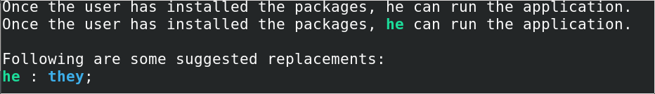

# inclusive
`inclusive` is a **multilingual application** for **inclusive writing**. Languages evolve. Developed in Python, this application helps to write texts in an inclusive way. The application detects possibly problematic phrases and suggests some replacements. 

The application is configurable and it permits the users to add
* support for new languages
* add new suggestions to existing languages
* update suggestions

## Usage
To use `inclusive`, specify the language and enter a text

```
python -m inclusive.main en
```


Here, `en` corresponds to the English language.


It is also possible to specify a file.

```
python3 -m inclusive.main en filepath
```


## Resources
[Resources](resources/README.md): Resources and references to sources in different languages

## Contribute
There are three ways to contribute:
* Add a missing language in [resources](./resources) folder and add it to [configuration.json](./configuration.json).
* Update existing lists of already existing languages. For example, in [English](./resources/en/list.json).
* Translate `inclusive`. Check existing or add new [locales](./locales).

A detailed desciption is present [here](./CONTRIBUTE.md).

## Test cases and coverage
All the test cases can be run in  the following manner
```
$ python3 -m tests.tests
```

Code coverage report can also be generated by running the unit tests using the coverage tool.
```
$ coverage run --source=inclusive -m unittest tests.tests
$ coverage report -m
```

## Author
* John Samuel

## Licence
All code are released under GPLv3+ licence. The associated documentation and other content are released under [CC-BY-SA](http://creativecommons.org/licenses/by-sa/4.0/).
